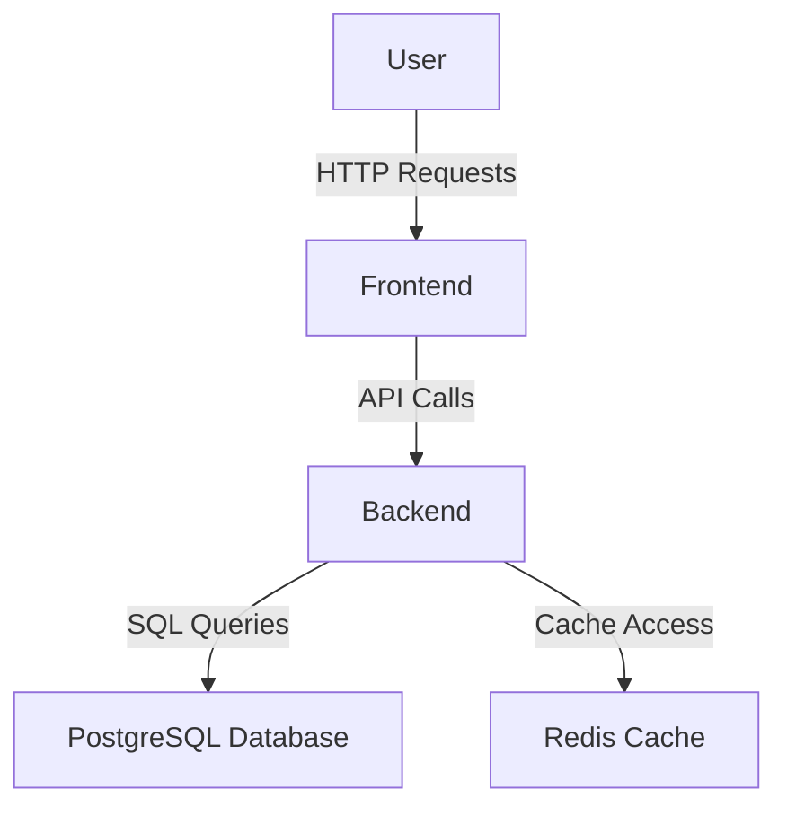

# TaskMaster Architecture

## System Design

### Overview
TaskMaster is designed as a microservices architecture, utilizing separate components for the frontend, backend, and database layers. This modular design facilitates scalability and maintainability.

### Component Descriptions
- **Frontend**: Developed using Next.js and TypeScript, the frontend leverages Tailwind CSS for styling and manages state using React Query and Zustand.
- **Backend**: The backend API is built with FastAPI, employing SQLAlchemy for ORM and Alembic for database migrations. Authentication is handled via JSON Web Tokens (JWT), using `python-jose`.
- **Database**: PostgreSQL serves as the primary relational database, while Redis is used for caching tasks and notifications.

### Data Flow
