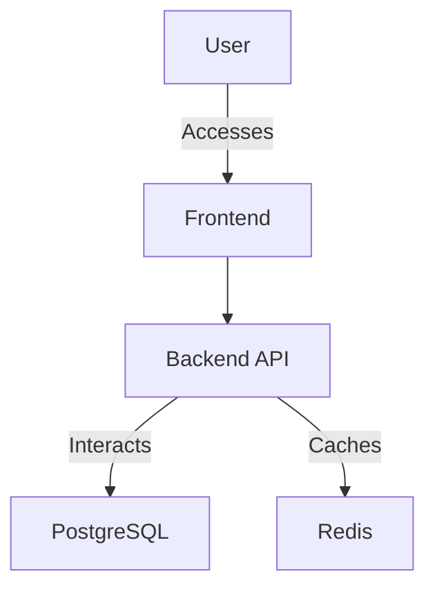

# TaskMaster: Organize your tasks effortlessly


TaskMaster is a productivity tool designed for busy professionals and students, enabling efficient task management with feature-rich capabilities.

## Features
- ✓ User Registration and Login
- ✓ Task Creation
- ✓ Task Editing
- ✓ Task Deletion
- ✓ Task Prioritization
- ✓ Task Completion
- ✓ Task Notifications
- ✓ Task Filtering and Sorting

## Quick Start
1. Clone the repository:
   ```bash
   git clone https://github.com/yourusername/taskmaster.git
   cd taskmaster
   ```
2. Build and run the Docker containers:
   ```bash
   docker-compose up --build
   ```
3. Access the application at `http://localhost:3000`

## Prerequisites
| Tool            | Version |
|-----------------|---------|
| Docker          | 20.10+  |
| Docker Compose  | 1.29+   |
| Node.js         | 16+     |
| Python          | 3.9+    |

## Docker Compose Setup
```yaml
docker-compose.yml
---
version: '3.8'
services:
  app:
    build: ./backend
    ports:
      - "8000:8000"
    environment:
      - DATABASE_URL=postgresql://user:password@db:5432/taskmaster
  db:
    image: postgres:15
    environment:
      POSTGRES_USER: user
      POSTGRES_PASSWORD: password
      POSTGRES_DB: taskmaster
  frontend:
    build: ./frontend
    ports:
      - "3000:3000"
  redis:
    image: redis:7
```

## API Usage Examples
### User Registration
```bash
curl -X POST "http://localhost:8000/api/v1/auth/register" \
-H "Content-Type: application/json" \
-d '{"email": "user@example.com", "password": "securepassword"}'
```

### Create a Task
```bash
curl -X POST "http://localhost:8000/api/v1/tasks" \
-H "Authorization: Bearer <access_token>" \
-H "Content-Type: application/json" \
-d '{"title": "Study", "description": "Read chapter 5", "due_date": "2023-10-01", "priority": "High"}'
```

## Environment Variables
| Name           | Required | Default                     | Description                        |
|----------------|----------|-----------------------------|------------------------------------|
| `DATABASE_URL` | Yes      | `postgresql://localhost`    | Database connection URL            |
| `REDIS_URL`    | Yes      | `redis://localhost:6379`    | Redis connection URL               |
| `SECRET_KEY`   | Yes      | `your-secret-key`           | Secret key for JWT token signing   |

## Architecture Diagram


## Tech Stack
| Component     | Technology                                              |
|---------------|--------------------------------------------------------|
| Backend       | Python (FastAPI 0.115+), SQLAlchemy, Pydantic          |
| Frontend      | Next.js, TypeScript, Tailwind CSS, React Query         |
| Database      | PostgreSQL 15, Redis 7                                 |
| Infrastructure| Docker, Docker Compose, GitHub Actions, Nginx          |

## Links
- [Documentation](./docs/)